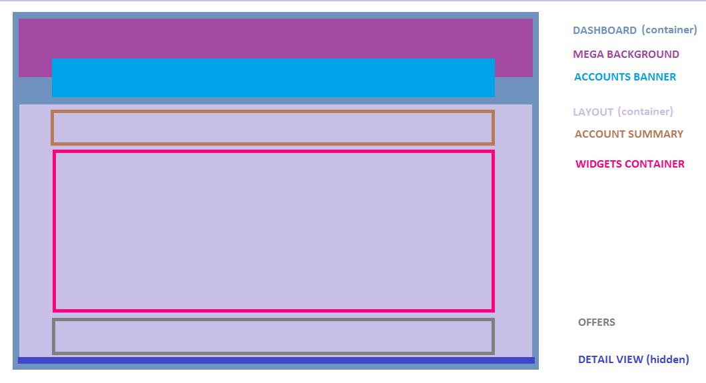

# Dashboard Module

The dashboard is the focal point of the application. Apart from one-off
views like `page-error` and `full-account-number`, the core CFI experience
is mediated through this dashboard.

## Component Hierarchy

* `dashboard.*` The dashboard container houses the "mega" background and
    header as well the accounts banner. It also contains the `ui-view`
    in which the `layout.*` component is loaded by default, and manages
    reloading this `ui-view` when the selected account changes.

* `./layout-default/layout.*` This container houses the account summary, the
    widgets container, the offers area, and the `detail-view` container. This
    container designed to be destroyed and recreated when the selected account
    changes and the dashboard state is no longer valid.
